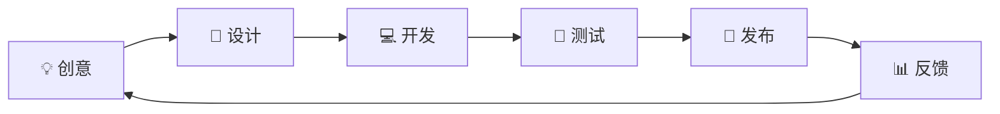

<div align="center">

# 👋 你好，我是 xiaomao8090


</div>

---

## 🚀 关于我

```lua
local Developer = {
    name = "xiaomao8090",
    role = "Roblox 开发者",
    languages = {"Lua", "Python", "JavaScript"},
    focus = "UI/UX 设计 & 游戏脚本开发",
    
    getCurrentProject = function()
        return "OPAI Dynamic Island - 灵动岛UI组件库"
    end,
    
    getInterests = function()
        return {
            "🎮 Roblox 脚本开发",
            "🎨 UI/UX 设计",
            "🔧 开源项目",
            "💡 创意编程"
        }
    end
}
```

<div align="center">

### 💼 技能树

</div>

<table align="center">
<tr>
<td align="center" width="50%">

#### 🎯 主要技能


</td>
<td align="center" width="50%">

#### 🛠️ 工具箱


</td>
</tr>
</table>

---

<div align="center">

## 📊 GitHub 统计


</div>

<div align="center">

### 📈 贡献图


</div>

<div align="center">

### 🏆 GitHub 成就


</div>

---

## 🎨 精选项目

<div align="center">

<a href="https://github.com/xiaomao8090/opai_ui">
  
</a>

</div>

### 🏝️ [OPAI Dynamic Island](https://github.com/xiaomao8090/opai_ui)

> 🎨 仿 iPhone 灵动岛的 Roblox UI 组件库

**特性：**
- ✨ 精美的灵动岛设计
- 📱 自适应响应式布局
- 🔔 智能通知队列系统
- 🎯 简单易用的 API

```lua
-- 一行代码即可使用
loadstring(game:HttpGet("https://raw.githubusercontent.com/xiaomao8090/opai_ui/main/Library/DynamicIsland_Library.lua"))()
```

---

<div align="center">

## 💡 最近活动

</div>

<!--START_SECTION:activity-->
1. 🎉 发布了 [OPAI Dynamic Island v1.0](https://github.com/xiaomao8090/opai_ui)
2. 📝 更新了项目文档
3. ✨ 添加了新功能
<!--END_SECTION:activity-->

---

<div align="center">

## 📫 联系我

[](https://github.com/xiaomao8090)

</div>

---

<div align="center">

### 💭 每日一言


</div>

---

<div align="center">

### 🎵 现在正在听

[](https://spotify-github-profile.vercel.app/api/view?uid=YOUR_SPOTIFY_ID&redirect=true)

<!-- 如果不用Spotify，可以删除这部分 -->

</div>

---

<div align="center">

### 📊 本周编码时间

<!--START_SECTION:waka-->
<!--END_SECTION:waka-->

</div>

---

<div align="center">

## 🐍 贡献蛇蛇


</div>

---

<div align="center">

### ⚡ 趣味数据


</div>

---

<div align="center">

## 💼 工作流程



</div>

---

<div align="center">

### 🎯 2025 年目标

- [x] ✅ 发布 OPAI Dynamic Island v1.0
- [ ] 📚 学习更多 Roblox 开发技巧
- [ ] 🎨 创建更多开源 UI 组件
- [ ] 🤝 参与更多开源项目
- [ ] 📝 写技术博客分享经验

</div>

---

<div align="center">

### 📈 GitHub 活跃度


</div>

---

<div align="center">

### 🎓 徽章墙


</div>

---

<div align="center">

### 🌟 支持我的工作

如果你喜欢我的项目，请给个 ⭐ Star！

<a href="https://github.com/xiaomao8090/opai_ui">
  
</a>

</div>

---

<div align="center">


**感谢访问我的主页！** 👋

<sub>最后更新: 自动更新 📅</sub>

</div>

